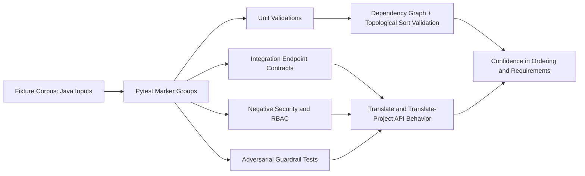
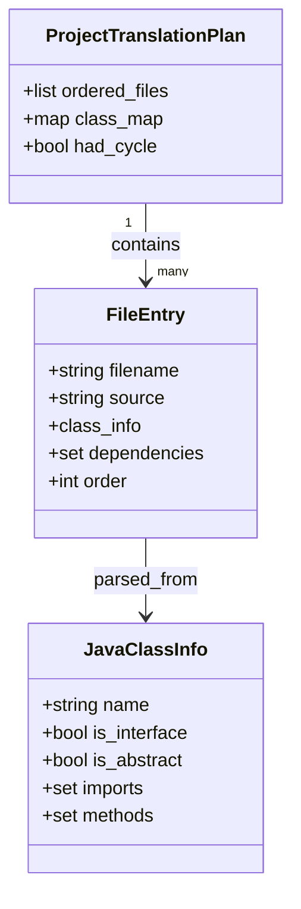
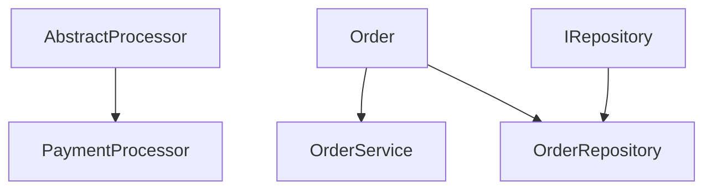
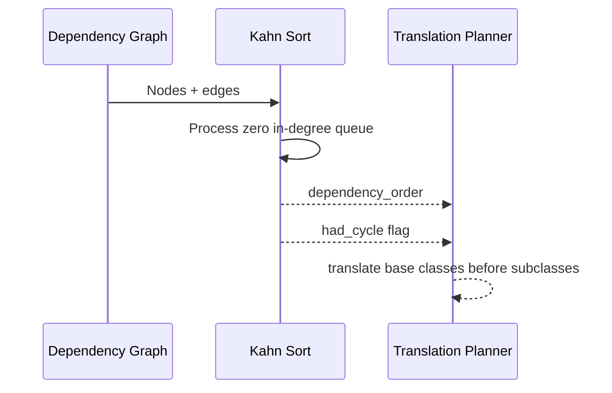
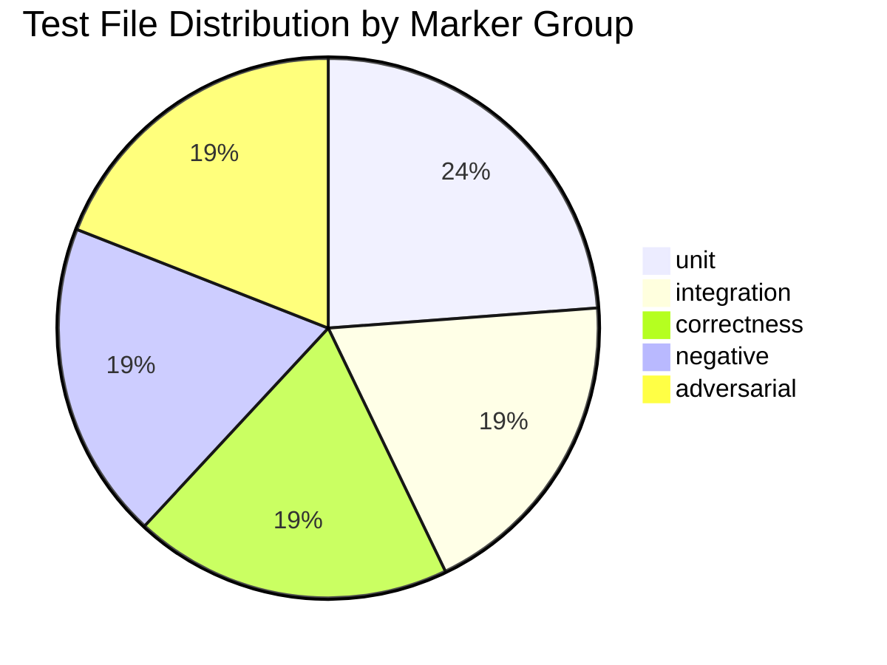
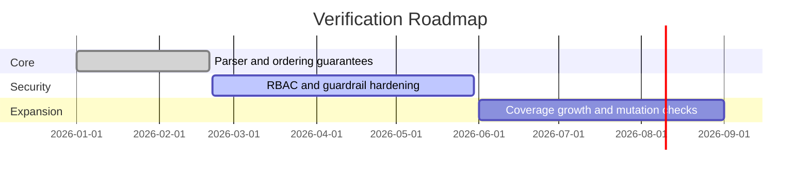

<a id="top"></a>

<div align="center">
  <h1>Java to Python Test Suite</h1>
  <p><em>Verification-first test infrastructure for secure, dependency-aware Java to Python translation services.</em></p>
</div>


## Executive Summary

This project uses a Python + pytest stack because it maximizes test expressiveness, async API coverage, and security-focused validation in one cohesive framework. The suite is intentionally built around comparison and traceability: each major requirement is represented in marker groups, assertion patterns, dependency ordering tests, and visual models.

### Why This Stack, How It Is Used, and Benefits

| Technology | Why Used | How Used in This Suite | Benefit Over Alternatives |
|---|---|---|---|
| Python 3.11+ | Fast iteration and excellent testing ecosystem | Executes all test layers and fixture logic | Lower friction than Java/JUnit for mixed async + security test authoring |
| pytest | Marker-based structure and fixture system | Separates unit/integration/correctness/negative/adversarial pipelines | Better parametrization and fixture ergonomics than unittest |
| pytest-asyncio | Native async compatibility | Runs async endpoint tests without custom event-loop wrappers | Cleaner than ad-hoc loop management |
| httpx + ASGITransport | In-process API contract testing | Calls API endpoints with dependency overrides and mock backends | Faster and more deterministic than external server + requests |
| cryptography + PyJWT | Realistic auth-path verification | Generates RSA keys and signs test JWTs at runtime | Stronger coverage than static token-only tests |
| javalang | Java structure awareness in validation workflows | Supports parser-oriented assertions in unit tests | More reliable than regex-only Java parsing checks |

> [!IMPORTANT]
> The suite verifies not only correctness, but also translation safety and dependency order requirements, including base-class-before-subclass guarantees through topological sorting tests.

## Table of Contents

- [Executive Summary](#executive-summary)
- [Overview](#overview)
- [Requirements to Validation Mapping](#requirements-to-validation-mapping)
- [Architecture](#architecture)
- [Object Model](#object-model)
- [Dependency Graph and Topological Sort](#dependency-graph-and-topological-sort)
- [Why Kahn's Algorithm Matters Here](#why-kahns-algorithm-matters-here)
- [Visualization as a Verification Tool](#visualization-as-a-verification-tool)
- [Technology Stack Decision Matrix](#technology-stack-decision-matrix)
- [Test Suite Breakdown](#test-suite-breakdown)
- [Setup and Installation](#setup-and-installation)
- [Usage](#usage)
- [Roadmap](#roadmap)
- [Contributing](#contributing)
- [License](#license)

## Overview

This repository is a dedicated test harness for a Java-to-Python translation service. It validates parser behavior, method/type fidelity, API contract integrity, authorization controls, guardrail enforcement, and adversarial resilience. It is designed for teams that need reproducible quality and security checks before releasing translation features.

> [!IMPORTANT]
> The suite assumes an external orchestrator source path and environment variables are available as configured in `conftest.py`.

Core value for this project:

- Confirms required behavior with explicit assertions (not heuristic checks only).
- Compares expected ordering and output properties against actual responses.
- Detects failures in dependency ordering and cycle handling early.
- Verifies that translation order favors reusable base components before dependents.

<p align="right">(<a href="#top">back to top</a>)</p>

## Requirements to Validation Mapping

| Requirement | Implementation Focus | Evidence in Test Suite | Outcome Verified |
|---|---|---|---|
| Parse Java artifacts safely | Parser and class-info extraction paths | `tests/unit/test_java_parsing.py` | AST/data extraction is stable for normal and malformed inputs |
| Build dependency graph correctly | Intra-project edge construction | `tests/unit/test_dependency_graph.py` | No self-loops, no JDK noise, valid class map |
| Sort translation order by dependency | Topological ordering logic | `tests/unit/test_topological_sort.py` | Dependencies appear before dependent classes |
| Translate base classes before subclasses | Ordering invariant in project translation plan | `tests/unit/test_topological_sort.py` and `tests/integration/test_project_translate_api.py` | Base abstractions precede concrete subclasses/services |
| Detect cycles without dropping files | Cycle fallback behavior | `tests/adversarial/test_circular_dependencies.py` and unit cycle tests | `had_cycle` is true and all files remain represented |
| Block unsafe or manipulative input | Input guardrails | `tests/adversarial/test_prompt_injection.py` and `tests/unit/test_guardrails.py` | Injection/secret patterns rejected before model path |
| Enforce RBAC and policy boundaries | JWT + permission checks | `tests/negative/test_rbac_enforcement.py` | Unauthorized roles/actions are denied |

<p align="right">(<a href="#top">back to top</a>)</p>

## Architecture



Architecture intent:

- Marker groups isolate concerns so each risk area is testable independently.
- Unit tests validate deterministic algorithmic behavior (graph and order).
- Integration tests confirm API contract fields like `dependency_order` and `had_cycle`.
- Security suites ensure unsafe requests fail fast and auditable paths stay intact.

<p align="right">(<a href="#top">back to top</a>)</p>

## Object Model



How this model helps:

- Makes ordering state explicit (`order`, `dependencies`, `had_cycle`).
- Supports comparison between parsed structure and output expectations.
- Enables requirement-level assertions that are easy to reason about in tests.

<p align="right">(<a href="#top">back to top</a>)</p>

## Dependency Graph and Topological Sort

The translation planner builds a directed dependency graph where each node is a class/file and edges represent prerequisite relationships (for example, subclass depends on base class).



The expected translation order is dependency-first:

1. Base abstractions and interfaces.
2. Core domain models.
3. Concrete implementations and services.

This is why tests verify examples such as Order before OrderService and AbstractProcessor before PaymentProcessor.

<details>
<summary>Dependency ordering checkpoints used by the suite</summary>

| Ordering Check | Why It Matters | Test Evidence |
|---|---|---|
| `Order` before `OrderService` | Service methods require model definitions first | Unit and integration ordering assertions |
| `AbstractProcessor` before `PaymentProcessor` | Subclass translation needs base contract context | Unit topological ordering assertions |
| `IRepository` before `OrderRepository` | Interface constraints should be available before implementation | Unit topological ordering assertions |
| Cycle path still returns all files | Production robustness under imperfect source graphs | Circular dependency adversarial/unit tests |

</details>

<p align="right">(<a href="#top">back to top</a>)</p>

## Why Kahn's Algorithm Matters Here

Kahn's algorithm is a topological sorting method for directed acyclic graphs.

High-level behavior:

1. Compute in-degree for each node.
2. Start with nodes that have in-degree 0 (no unmet dependencies).
3. Remove processed nodes and decrement neighbors.
4. Continue until all nodes are processed.
5. If nodes remain with non-zero in-degree, a cycle exists.

In this test suite, that behavior directly supports translation correctness:

- Guarantees dependency-first ordering for base classes and shared contracts.
- Prevents subclass-first generation that can create invalid imports/signatures.
- Detects cycles early while still preserving a complete output list for diagnostics.



> [!TIP]
> Kahn's approach is deterministic and testable: each assertion can verify that every dependency index is lower than its dependent index.

<p align="right">(<a href="#top">back to top</a>)</p>

## Visualization as a Verification Tool

Visualizations in this README are not decorative. They reduce ambiguity when comparing implemented function behavior against requirements.

| Visualization | Confirms | Comparison Benefit |
|---|---|---|
| Architecture flowchart | End-to-end validation pipeline | Quickly spots missing validation layers |
| Object model diagram | Data structures and relationships | Confirms required fields exist for assertions |
| Dependency graph diagram | Expected dependency direction | Makes ordering mistakes obvious during review |
| Kahn sequence diagram | Algorithm steps and outputs | Aligns function behavior with requirement statements |

How this helps requirement comparison:

- Requirement text says dependency-first translation.
- Graph + sequence diagrams show exactly how dependency-first behavior is enforced.
- Unit tests then compare actual order indices to required invariants.
- Integration tests compare API `dependency_order` to expected file precedence.

<p align="right">(<a href="#top">back to top</a>)</p>

## Technology Stack Decision Matrix

| Stack Part | Chosen Option | Alternative | Why Chosen for This Project | Practical Benefit |
|---|---|---|---|---|
| Test framework | pytest | unittest | Marker groups and fixture composition scale better for layered suites | Faster targeted runs and cleaner test organization |
| Async testing | pytest-asyncio | custom loop management | Native async test support without boilerplate | Lower maintenance and fewer flaky async tests |
| API client | httpx + ASGITransport | requests + live server | In-process execution keeps integration tests deterministic | Better speed and less CI networking variability |
| Auth validation | cryptography + PyJWT | static token strings | Runtime key/signature generation tests real verification paths | Higher confidence in RBAC behavior |
| Java structure parsing | javalang | regex parsing | Structural parsing avoids brittle text matching | More robust dependency and class extraction checks |

<details>
<summary>Technology usage map by test concern</summary>

| Test Concern | Main Technology | Role |
|---|---|---|
| Parser and graph correctness | pytest + javalang | Validates class extraction and dependency edges |
| Endpoint behavior | pytest-asyncio + httpx | Exercises translate endpoints and payload contracts |
| RBAC and token handling | cryptography + PyJWT | Generates realistic signed JWTs for role checks |
| Guardrails and adversarial handling | pytest markers + fixtures | Enforces injection/secret blocking expectations |

</details>

<p align="right">(<a href="#top">back to top</a>)</p>

## Test Suite Breakdown



| Marker Group | Purpose | Key Benefit |
|---|---|---|
| unit | Algorithmic correctness for parsing/graph/order | Fast feedback on core logic |
| integration | API request/response and contract validation | Catches wiring and schema regressions |
| correctness | Python output structure and signature quality | Protects translation fidelity |
| negative | Policy and access-control enforcement | Prevents unsafe execution paths |
| adversarial | Injection and malformed input hardening | Reduces attack-surface risk |

<p align="right">(<a href="#top">back to top</a>)</p>

## Setup and Installation

Prerequisites:

- Python 3.11+
- Access to the orchestrator source path expected by `conftest.py`

Install:

```bash
python -m venv .venv
source .venv/bin/activate
pip install -r requirements.txt
```

Optional local env file:

```bash
cp .env.example .env
```

Quick validation:

```bash
pytest --collect-only -q
```

<p align="right">(<a href="#top">back to top</a>)</p>

## Usage

Run full suite:

```bash
pytest -q
```

Run by concern:

```bash
pytest -m unit -q
pytest -m integration -q
pytest -m correctness -q
pytest -m negative -q
pytest -m adversarial -q
```

Focused debugging flow:

1. Install dependencies.
2. Run the relevant marker group.
3. Use `-k` to isolate failing behavior.
4. Re-run the same slice to confirm regression closure.

```bash
pytest -m integration -k dependency_order -q
```

> [!TIP]
> For long local runs, use <kbd>Ctrl</kbd>+<kbd>C</kbd> to stop gracefully and keep the latest failure summary.

<p align="right">(<a href="#top">back to top</a>)</p>

## Roadmap



| Phase | Goals | Target | Status |
|---|---|---|---|
| Core | Preserve dependency and translation order correctness | Q1 2026 | Complete |
| Security | Broaden adversarial and RBAC scenarios | Q2 2026 | In progress |
| Expansion | Add mutation testing and richer fixture corpora | Q3 2026 | Planned |

<p align="right">(<a href="#top">back to top</a>)</p>

## Contributing

See `CONTRIBUTING.md` for workflow and test expectations.

<details>
<summary>Quality checklist for pull requests</summary>

- Add or update tests for each behavior change.
- Preserve dependency-order invariants in project translation paths.
- Keep fixtures deterministic and security-safe.
- Run targeted marker groups plus a full suite pass before opening a PR.

</details>

<p align="right">(<a href="#top">back to top</a>)</p>

## License

This project is licensed under the MIT License. See `LICENSE` for details.

<p align="right">(<a href="#top">back to top</a>)</p>
