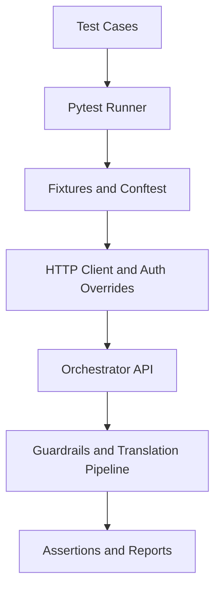
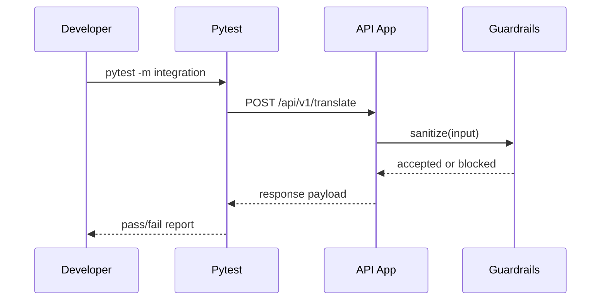
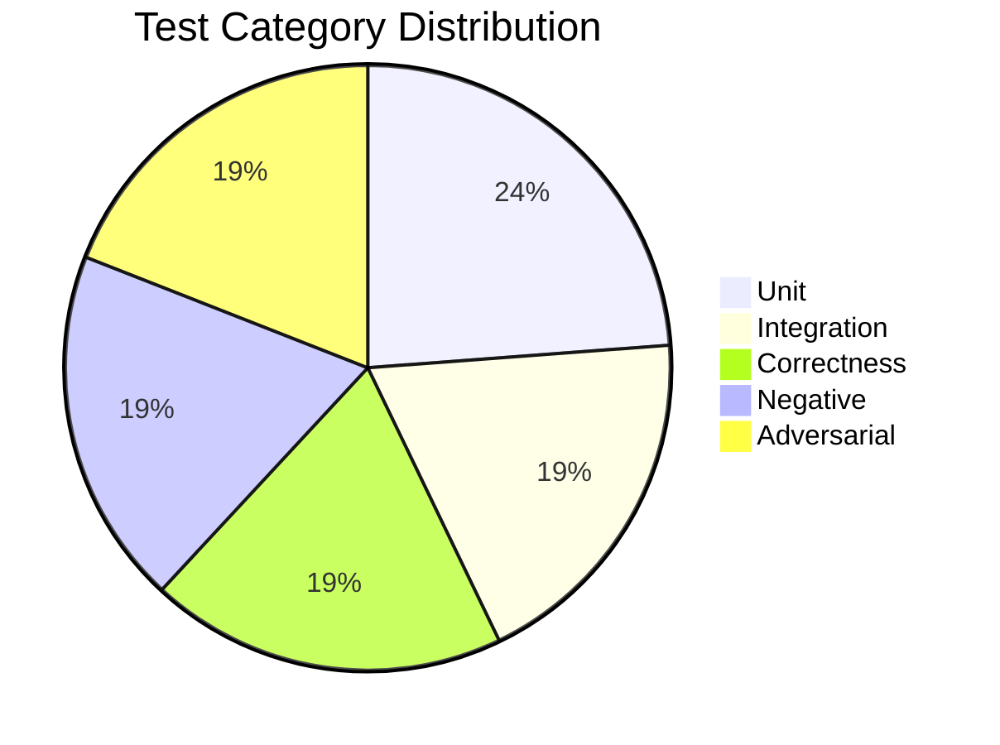
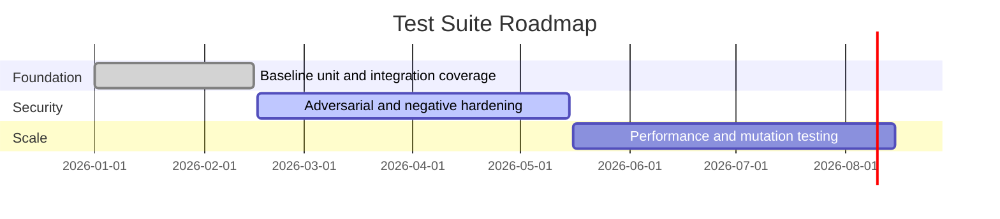

<a id="top"></a>

<div align="center">
  <h1>Java to Python Test Suite</h1>
  <p><em>A security-focused, multi-layer test suite for validating Java-to-Python translation services.</em></p>
</div>


## Table of Contents

- [Overview](#overview)
- [Key Features](#key-features)
- [Architecture](#architecture)
- [Usage Flow](#usage-flow)
- [Category Breakdown](#category-breakdown)
- [Technology Stack](#technology-stack)
- [Setup and Installation](#setup-and-installation)
- [Running the Suite](#running-the-suite)
- [Roadmap](#roadmap)
- [Development Status](#development-status)
- [Contributing](#contributing)
- [License](#license)

## Overview

This repository provides a dedicated test harness for a Java-to-Python translation service. The suite validates parser behavior, output structure, API contracts, authorization boundaries, and adversarial resilience. It is designed for teams operating LLM-backed developer tools that require strong guardrails and reproducible quality checks.

> [!IMPORTANT]
> The suite assumes an external orchestrator service path and environment variables are available as configured in `conftest.py`.

<p align="right">(<a href="#top">back to top</a>)</p>

## Key Features

| Feature | Description | Impact | Status |
|---|---|---|---|
| Multi-layer test taxonomy | Unit, integration, correctness, negative, and adversarial coverage | High | Stable |
| Built-in auth fixtures | RSA keypair + JWT generation for role and expiry tests | High | Stable |
| Guardrail validation | Input/output safety tests for injection and policy leakage | High | Stable |
| API-level checks | Endpoint contract verification using async HTTP clients | Medium | Stable |
| Deterministic fixture corpus | Reusable Java snippets and expected Python outputs | Medium | Stable |

- Marker-based organization enables targeted quality gates in CI.
- Adversarial test modules verify prompt-injection resistance before LLM call paths.
- Negative tests enforce RBAC and model/egress constraints.
- Correctness tests validate output validity, imports, signatures, and structure.

<details>
<summary>Expanded coverage map</summary>

- `tests/unit`: parser and transformation primitives
- `tests/integration`: endpoint behavior and audit trail
- `tests/correctness`: translated artifact quality checks
- `tests/negative`: security and policy denial paths
- `tests/adversarial`: malformed input, boundary, and injection scenarios

</details>

<p align="right">(<a href="#top">back to top</a>)</p>

## Architecture



The suite is layered around pytest entry points and shared fixtures. Fixture constants model Java source inputs and expected outputs while auth helpers generate signed JWTs for permission checks.

Integration tests use ASGI transport clients and dependency overrides to validate endpoint behavior without relying on external network calls for authentication.

<p align="right">(<a href="#top">back to top</a>)</p>

## Usage Flow



Typical workflow:

1. Install dependencies.
2. Execute a focused marker group.
3. Review failures and iterate on service behavior.

```bash
pytest -m unit -q
pytest -m correctness -q
pytest -m adversarial -q
```

> [!TIP]
> Use `-k` to narrow down failures quickly, for example `pytest -m integration -k translate -q`.

<p align="right">(<a href="#top">back to top</a>)</p>

## Category Breakdown



| Category | Test Files | Approx. Share |
|---|---:|---:|
| Unit | 5 | 23.8% |
| Integration | 4 | 19.0% |
| Correctness | 4 | 19.0% |
| Negative | 4 | 19.0% |
| Adversarial | 4 | 19.0% |

<p align="right">(<a href="#top">back to top</a>)</p>

## Technology Stack

| Technology | Purpose | Why Chosen | Alternatives |
|---|---|---|---|
| Python | Test runtime | Strong tooling and async support | Node.js test stacks |
| Pytest | Test framework | Marker system + fixtures + ecosystem | unittest, nose2 |
| pytest-asyncio | Async test execution | Native async test support | anyio-only approaches |
| httpx | ASGI-level API tests | Fast in-process API validation | requests + live server |
| cryptography + PyJWT | JWT and keypair testing | Realistic auth-path coverage | static token fixtures |
| javalang | Java parsing support | Domain-relevant parser dependency | custom parser logic |

<p align="right">(<a href="#top">back to top</a>)</p>

## Setup and Installation

Prerequisites:

- Python 3.11+
- Access to the associated orchestrator source path expected by `conftest.py`

Install:

```bash
python -m venv .venv
source .venv/bin/activate
pip install -r requirements.txt
```

Optional environment file:

```bash
cp .env.example .env
```

Verification:

```bash
pytest --collect-only -q
```

<p align="right">(<a href="#top">back to top</a>)</p>

## Running the Suite

```bash
# all tests
pytest -q

# by marker
pytest -m unit -q
pytest -m integration -q
pytest -m correctness -q
pytest -m negative -q
pytest -m adversarial -q
```

Keyboard shortcuts while local runs are active:

- Press <kbd>Ctrl</kbd>+<kbd>C</kbd> once to stop and show current summary.
- Press <kbd>Ctrl</kbd>+<kbd>C</kbd> again to force quit if needed.

<details>
<summary>Common troubleshooting</summary>

- Ensure the orchestrator source path referenced by `conftest.py` exists.
- Confirm required environment variables are present before import-time settings load.
- If auth failures occur, check JWT key initialization in root test fixtures.

</details>

<p align="right">(<a href="#top">back to top</a>)</p>

## Roadmap



| Phase | Goals | Target | Status |
|---|---|---|---|
| Foundation | Baseline endpoint + parser correctness checks | Q1 2026 | Complete |
| Security | Broaden adversarial and RBAC scenarios | Q2 2026 | In progress |
| Scale | Add performance and mutation-based confidence gates | Q3 2026 | Planned |

<p align="right">(<a href="#top">back to top</a>)</p>

## Development Status

| Version | Stability | Coverage Focus | Known Limitations |
|---|---|---|---|
| 0.1.x | Stable for internal use | Security and API contract tests | Depends on external orchestrator path |
| 0.2.x (planned) | In progress | Broader fixture corpus and edge cases | Benchmark automation not yet added |

> [!WARNING]
> If orchestrator module paths change, import-time setup in `conftest.py` must be updated before test execution.

<p align="right">(<a href="#top">back to top</a>)</p>

## Contributing

See `CONTRIBUTING.md` for workflow and test expectations.

<details>
<summary>Quick PR checklist</summary>

- Add or update tests for every behavior change.
- Keep fixtures deterministic.
- Run `pytest -q` before opening a PR.
- Use focused commits with clear summaries.

</details>

<p align="right">(<a href="#top">back to top</a>)</p>

## License

This project is licensed under the MIT License. See `LICENSE` for details.

<p align="right">(<a href="#top">back to top</a>)</p>
