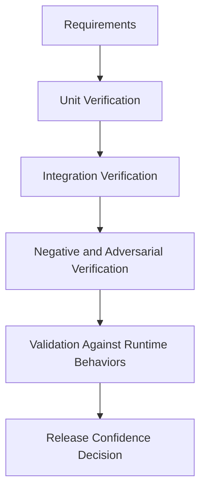
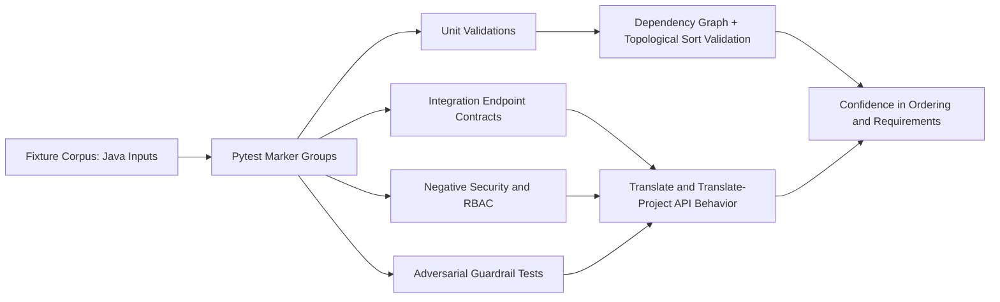
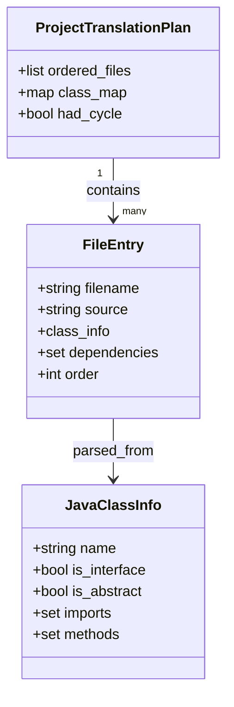
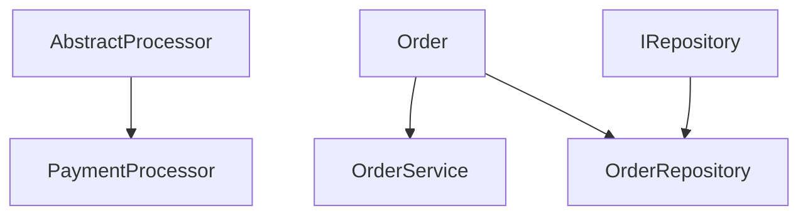
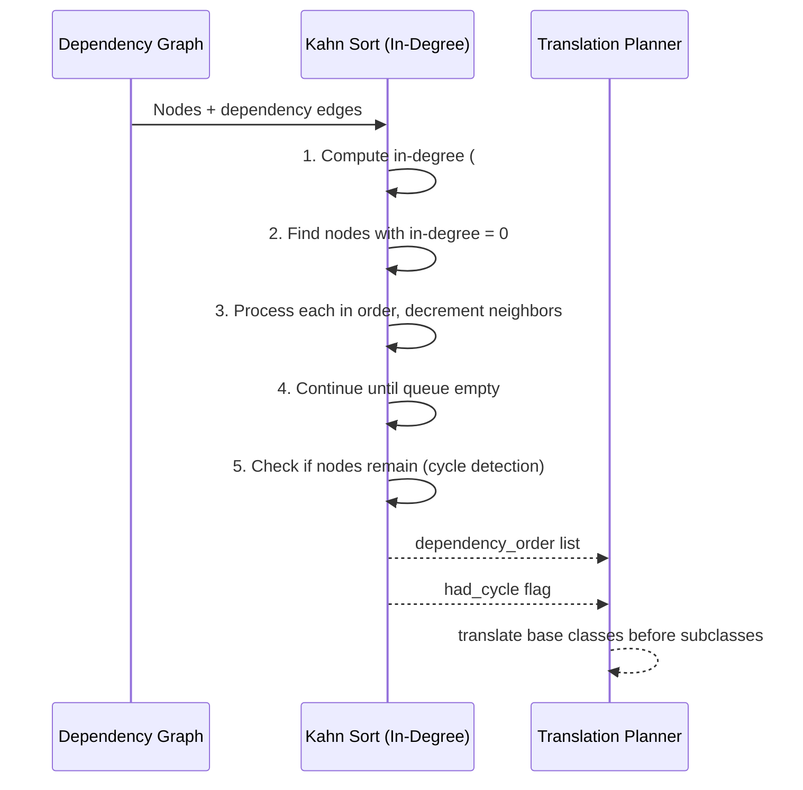
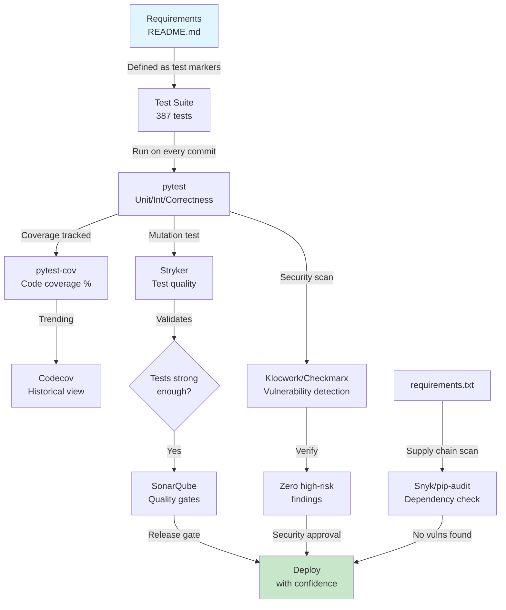
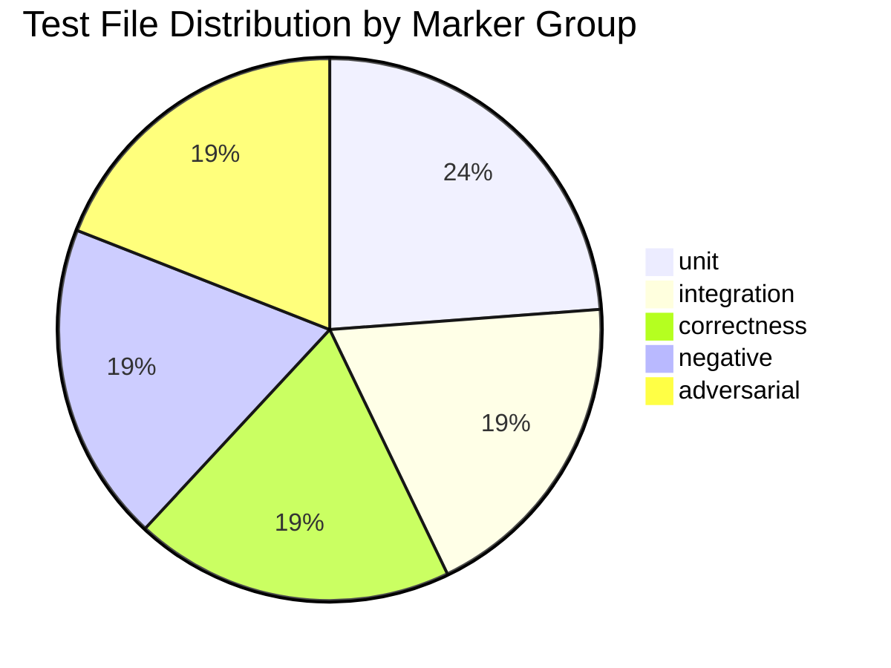
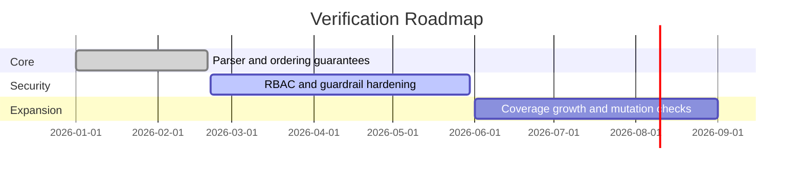

<a id="top"></a>

<div align="center">
  <h1>Java to Python Test Suite</h1>
  <p><em>Verification-first test infrastructure for secure, dependency-aware Java to Python translation services.</em></p>
</div>


## Executive Summary

This project uses a Python + pytest stack because it maximizes test expressiveness, async API coverage, and security-focused validation in one cohesive framework. The suite is intentionally built around comparison and traceability: each major requirement is represented in marker groups, assertion patterns, dependency ordering tests, and visual models.

### Why This Stack, How It Is Used, and Benefits

| Technology | Why Used | How Used in This Suite | Benefit Over Alternatives |
|---|---|---|---|
| Python 3.11+ | Fast iteration and excellent testing ecosystem | Executes all test layers and fixture logic | Lower friction than Java/JUnit for mixed async + security test authoring |
| pytest | Marker-based structure and fixture system | Separates unit/integration/correctness/negative/adversarial pipelines | Better parametrization and fixture ergonomics than unittest |
| pytest-asyncio | Native async compatibility | Runs async endpoint tests without custom event-loop wrappers | Cleaner than ad-hoc loop management |
| httpx + ASGITransport | In-process API contract testing | Calls API endpoints with dependency overrides and mock backends | Faster and more deterministic than external server + requests |
| cryptography + PyJWT | Realistic auth-path verification | Generates RSA keys and signs test JWTs at runtime | Stronger coverage than static token-only tests |
| javalang | Java structure awareness in validation workflows | Supports parser-oriented assertions in unit tests | More reliable than regex-only Java parsing checks |

> [!IMPORTANT]
> The suite verifies not only correctness, but also translation safety and dependency order requirements, including base-class-before-subclass guarantees through topological sorting tests.

## Table of Contents

- [Executive Summary](#executive-summary)
- [Overview](#overview)
- [Requirements to Validation Mapping](#requirements-to-validation-mapping)
- [Requirements Verification and Validation](#requirements-verification-and-validation)
- [Architecture](#architecture)
- [Object Model](#object-model)
- [Dependency Graph and Topological Sort](#dependency-graph-and-topological-sort)
- [Why Kahn's Algorithm Matters Here](#why-kahns-algorithm-matters-here)
- [Visualization as a Verification Tool](#visualization-as-a-verification-tool)
- [Technology Stack Decision Matrix](#technology-stack-decision-matrix)
- [Test Suite Breakdown](#test-suite-breakdown)
- [Setup and Installation](#setup-and-installation)
- [Usage](#usage)
- [Roadmap](#roadmap)
- [Contributing](#contributing)
- [License](#license)

## Overview

This repository is a dedicated test harness for a Java-to-Python translation service. It validates parser behavior, method/type fidelity, API contract integrity, authorization controls, guardrail enforcement, and adversarial resilience. It is designed for teams that need reproducible quality and security checks before releasing translation features.

> [!IMPORTANT]
> The suite assumes an external orchestrator source path and environment variables are available as configured in `conftest.py`.

Core value for this project:

- Confirms required behavior with explicit assertions (not heuristic checks only).
- Compares expected ordering and output properties against actual responses.
- Detects failures in dependency ordering and cycle handling early.
- Verifies that translation order favors reusable base components before dependents.

<p align="right">(<a href="#top">back to top</a>)</p>

## Requirements to Validation Mapping

| Requirement | Implementation Focus | Evidence in Test Suite | Outcome Verified |
|---|---|---|---|
| Parse Java artifacts safely | Parser and class-info extraction paths | `tests/unit/test_java_parsing.py` | AST/data extraction is stable for normal and malformed inputs |
| Build dependency graph correctly | Intra-project edge construction | `tests/unit/test_dependency_graph.py` | No self-loops, no JDK noise, valid class map |
| Sort translation order by dependency | Topological ordering logic | `tests/unit/test_topological_sort.py` | Dependencies appear before dependent classes |
| Translate base classes before subclasses | Ordering invariant in project translation plan | `tests/unit/test_topological_sort.py` and `tests/integration/test_project_translate_api.py` | Base abstractions precede concrete subclasses/services |
| Detect cycles without dropping files | Cycle fallback behavior | `tests/adversarial/test_circular_dependencies.py` and unit cycle tests | `had_cycle` is true and all files remain represented |
| Block unsafe or manipulative input | Input guardrails | `tests/adversarial/test_prompt_injection.py` and `tests/unit/test_guardrails.py` | Injection/secret patterns rejected before model path |
| Enforce RBAC and policy boundaries | JWT + permission checks | `tests/negative/test_rbac_enforcement.py` | Unauthorized roles/actions are denied |

<p align="right">(<a href="#top">back to top</a>)</p>

## Requirements Verification and Validation

This suite applies both verification and validation:

- Verification asks: are we building the system right against explicit requirements?
- Validation asks: are we building the right behavior for secure translation operations?

### V&V Strategy Matrix

| Requirement Area | Verification Method | Validation Method | Pass Criteria | Primary Evidence |
|---|---|---|---|---|
| Dependency graph correctness | Unit assertions on graph edges and node invariants | Integration checks of API dependency output | No self-loops, no missing files, dependency-first order | `tests/unit/test_dependency_graph.py`, `tests/integration/test_project_translate_api.py` |
| Topological ordering (base before subclass) | Unit invariant checks for order index relationships | Project-level translate API response order checks | For every edge A depends on B, index(B) < index(A) | `tests/unit/test_topological_sort.py`, `tests/integration/test_project_translate_api.py` |
| Cycle detection robustness | Unit and adversarial cycle test scenarios | End-to-end circular project request handling | `had_cycle` true on cyclic input, all files retained in output | `tests/adversarial/test_circular_dependencies.py`, `tests/unit/test_topological_sort.py` |
| Security guardrails | Unit and adversarial pattern blocking tests | API-level blocked request behavior checks | Injection and credential patterns rejected before unsafe processing | `tests/unit/test_guardrails.py`, `tests/adversarial/test_prompt_injection.py` |
| RBAC and auth correctness | Negative role/permission tests | Unauthorized API paths return denied responses | Role permissions enforced with no privilege escalation | `tests/negative/test_rbac_enforcement.py`, integration auth tests |
| Output structure fidelity | Correctness tests over syntax/import/signatures | Workflow-level usage consistency checks | Outputs remain parseable and structurally aligned to expectations | `tests/correctness/*.py` |

### Verification Pipeline



### Validation Acceptance Gates

| Gate | Scope | Command Pattern | Minimum Acceptance |
|---|---|---|---|
| Gate 1 | Core logic verification | `pytest -m unit -q` | All dependency/order/parser tests pass |
| Gate 2 | API contract verification | `pytest -m integration -q` | Endpoint contract fields and ordering checks pass |
| Gate 3 | Security validation | `pytest -m negative -q && pytest -m adversarial -q` | RBAC, injection, and egress/model policy checks pass |
| Gate 4 | Output quality validation | `pytest -m correctness -q` | Output syntax/structure/import quality checks pass |
| Gate 5 | Full-system confidence | `pytest -q` | No regressions across all marker groups |

### Traceability Notes

- Requirement-to-test traceability is explicit through marker groups and targeted modules.
- Visualization-to-requirement traceability is captured by architecture, object model, and dependency diagrams.
- Algorithm-to-requirement traceability is captured by Kahn ordering assertions that enforce base-before-subclass translation.

> [!NOTE]
> V&V is strongest when failures are triaged by marker group first, then by requirement area, so remediation stays requirement-focused rather than only test-focused.

<p align="right">(<a href="#top">back to top</a>)</p>

## Architecture



Architecture intent:

- Marker groups isolate concerns so each risk area is testable independently.
- Unit tests validate deterministic algorithmic behavior (graph and order).
- Integration tests confirm API contract fields like `dependency_order` and `had_cycle`.
- Security suites ensure unsafe requests fail fast and auditable paths stay intact.

<p align="right">(<a href="#top">back to top</a>)</p>

## Object Model



How this model helps:

- Makes ordering state explicit (`order`, `dependencies`, `had_cycle`).
- Supports comparison between parsed structure and output expectations.
- Enables requirement-level assertions that are easy to reason about in tests.

<p align="right">(<a href="#top">back to top</a>)</p>

## Dependency Graph and Topological Sort

The translation planner builds a directed dependency graph where each node is a class/file and edges represent prerequisite relationships (for example, subclass depends on base class).



The expected translation order is dependency-first:

1. Base abstractions and interfaces.
2. Core domain models.
3. Concrete implementations and services.

This is why tests verify examples such as Order before OrderService and AbstractProcessor before PaymentProcessor.

<details>
<summary>Dependency ordering checkpoints used by the suite</summary>

| Ordering Check | Why It Matters | Test Evidence |
|---|---|---|
| `Order` before `OrderService` | Service methods require model definitions first | Unit and integration ordering assertions |
| `AbstractProcessor` before `PaymentProcessor` | Subclass translation needs base contract context | Unit topological ordering assertions |
| `IRepository` before `OrderRepository` | Interface constraints should be available before implementation | Unit topological ordering assertions |
| Cycle path still returns all files | Production robustness under imperfect source graphs | Circular dependency adversarial/unit tests |

</details>

<p align="right">(<a href="#top">back to top</a>)</p>

## Why Kahn's Algorithm Matters Here

### What is Kahn's Algorithm? (Layman's Explanation)

Imagine you have a to-do list with dependencies:
- Task A: "Learn Python" (must do first)
- Task B: "Build a web app" (depends on Task A - you need Python knowledge)
- Task C: "Deploy the app" (depends on Task B - you need a working app to deploy)

You can't do Task B until Task A is done. You can't do Task C until Task B is done. **Kahn's algorithm automatically figures out the correct order to do tasks when there are many interdependencies.**

In our case, we have Java classes instead of tasks:
- Order.java (no dependencies - do first)
- OrderService.java (depends on Order)
- OrderRepository.java (depends on both Order and OrderService)

Kahn's algorithm ensures Order.java is translated to Python before OrderService.java, which is translated before OrderRepository.java.

### How Kahn's Algorithm Works (Step by Step)

**Step 1: Count Prerequisites (In-Degree)**
For each class, count how many other classes it needs:
```
Order:             0 dependencies (no prerequisites)
OrderService:      1 dependency (depends on Order)
OrderRepository:   2 dependencies (depends on Order and OrderService)
```

**Step 2: Find Classes with Zero Prerequisites**
Start with classes that don't depend on anything:
```
Queue = [Order]  (has 0 dependencies)
```

**Step 3: Process One Class at a Time**
- Take Order from the queue
- Tell all classes that depend on Order: "Order is done!"
- OrderService loses one dependency (Order is now satisfied)
- OrderRepository loses one dependency (Order is now satisfied)
- Check if any class now has zero dependencies:
  - OrderService: 1 - 1 = 0 dependencies left → Add to queue!
```
Processed = [Order]
Queue = [OrderService]
```

**Step 4: Repeat**
- Take OrderService from the queue
- Tell OrderRepository: "OrderService is done!"
- OrderRepository: 2 - 1 = 1 dependency left (still needs Order, but it's already done)
  - Actually, Order was already processed, so OrderRepository should have 1 left
  - But both its dependencies (Order, OrderService) are done → Add to queue!
```
Processed = [Order, OrderService]
Queue = [OrderRepository]
```

- Take OrderRepository from the queue
- No classes depend on it
```
Processed = [Order, OrderService, OrderRepository]
Queue = []  (empty - we're done!)
```

**Step 5: Detect Cycles**
If some classes remain with unmet dependencies after processing everything, there's a **circular dependency** (cycle):
- A depends on B
- B depends on C
- C depends on A (creates a circle!)

These classes can't be properly ordered, but the algorithm includes them anyway so you're aware of the problem.

### Algorithm Pseudo-Code

```
function KahnSort(graph):
    // Count how many dependencies each node has
    for each node in graph:
        in_degree[node] = count of nodes it depends on
    
    // Find who depends on whom (reverse lookup)
    for each edge (A depends on B):
        dependents[B].add(A)
    
    // Start with nodes that have no dependencies
    queue = [all nodes where in_degree = 0]
    result = []
    
    // Process nodes in order
    while queue is not empty:
        current = queue.pop()
        result.add(current)
        
        // For each node that depends on current:
        for each dependent in dependents[current]:
            dependent.in_degree -= 1
            if dependent.in_degree = 0:
                queue.add(dependent)
    
    // Check for cycles
    if result.size < graph.size:
        had_cycle = TRUE
        // Add remaining nodes (they're in a cycle)
        result.add(remaining nodes)
    
    return (result, had_cycle)
```

### Real-World Code Example from This Project

When we have Java files:

```java
// Order.java
public class Order { ... }

// OrderService.java
public class OrderService {
    private Order order;  // depends on Order!
    ...
}

// OrderRepository.java
public interface OrderRepository {
    Order findById(String id);  // depends on Order!
}
```

Kahn's algorithm outputs: `[Order, OrderService, OrderRepository]`

This guarantees:
- Order is translated first
- OrderService can reference Order class (exists in Python)
- OrderRepository can reference Order class (exists in Python)

### Why Not Just Random Order?

If we translated OrderService before Order:
```python
class OrderService:
    def __init__(self):
        self.order: Order  # ERROR! Order not defined yet!
```

This fails because Order doesn't exist yet. Kahn's algorithm prevents this.

### High-level behavior (The original formulation):

1. Compute in-degree for each node.
2. Start with nodes that have in-degree 0 (no unmet dependencies).
3. Remove processed nodes and decrement neighbors' in-degree.
4. Continue until all nodes are processed.
5. If nodes remain with non-zero in-degree, a cycle exists.

In this test suite, that behavior directly supports translation correctness:

- Guarantees dependency-first ordering for base classes and shared contracts.
- Prevents subclass-first generation that can create invalid imports/signatures.
- Detects cycles early while still preserving a complete output list for diagnostics.



> [!TIP]
> Kahn's approach is deterministic and testable: each assertion can verify that every dependency index is lower than its dependent index. The algorithm guarantees: if class B must be translated before class A (A depends on B), then index(B) < index(A) in the output list.

<p align="right">(<a href="#top">back to top</a>)</p>

## Visualization as a Verification Tool

Visualizations in this README are not decorative. They reduce ambiguity when comparing implemented function behavior against requirements.

| Visualization | Confirms | Comparison Benefit |
|---|---|---|
| Architecture flowchart | End-to-end validation pipeline | Quickly spots missing validation layers |
| Object model diagram | Data structures and relationships | Confirms required fields exist for assertions |
| Dependency graph diagram | Expected dependency direction | Makes ordering mistakes obvious during review |
| Kahn sequence diagram | Algorithm steps and outputs | Aligns function behavior with requirement statements |

How this helps requirement comparison:

- Requirement text says dependency-first translation.
- Graph + sequence diagrams show exactly how dependency-first behavior is enforced.
- Unit tests then compare actual order indices to required invariants.
- Integration tests compare API `dependency_order` to expected file precedence.

<p align="right">(<a href="#top">back to top</a>)</p>

## Technology Stack Decision Matrix

| Stack Part | Chosen Option | Alternative | Why Chosen for This Project | Practical Benefit |
|---|---|---|---|---|
| Test framework | pytest | unittest | Marker groups and fixture composition scale better for layered suites | Faster targeted runs and cleaner test organization |
| Async testing | pytest-asyncio | custom loop management | Native async test support without boilerplate | Lower maintenance and fewer flaky async tests |
| API client | httpx + ASGITransport | requests + live server | In-process execution keeps integration tests deterministic | Better speed and less CI networking variability |
| Auth validation | cryptography + PyJWT | static token strings | Runtime key/signature generation tests real verification paths | Higher confidence in RBAC behavior |
| Java structure parsing | javalang | regex parsing | Structural parsing avoids brittle text matching | More robust dependency and class extraction checks |

<details>
<summary>Technology usage map by test concern</summary>

| Test Concern | Main Technology | Role |
|---|---|---|
| Parser and graph correctness | pytest + javalang | Validates class extraction and dependency edges |
| Endpoint behavior | pytest-asyncio + httpx | Exercises translate endpoints and payload contracts |
| RBAC and token handling | cryptography + PyJWT | Generates realistic signed JWTs for role checks |
| Guardrails and adversarial handling | pytest markers + fixtures | Enforces injection/secret blocking expectations |

</details>

<p align="right">(<a href="#top">back to top</a>)</p>

## Testing & Quality Assurance Tool Integration Matrix

This test suite can be enhanced through integration with specialized testing, analysis, and verification tools. Below are recommended integrations organized by capability:

### Static Code Analysis Tools (Top-to-Bottom Requirements Verification)

| Tool | Purpose | Integration Point | Validates | Python Support | Cost Model |
|---|---|---|---|---|---|
| **Klocwork** (Perforce) | SAST - Security, quality, reliability | Pre-commit hooks, CI/CD pipeline | Security vulnerabilities, code defects, reliability issues | ✅ Yes | Enterprise/Commercial |
| **SonarQube** | Code quality & maintainability | Post-test analysis, quality gates | Code quality, technical debt, duplication, test coverage | ✅ Yes | Open-source/Commercial |
| **Checkmarx (SAST)** | Enterprise security scanning | Pipeline integration, compliance | Deep vulnerability analysis, compliance standards, OWASP | ✅ Yes | Enterprise/Commercial |
| **Coverity** (Synopsys) | Deep static analysis | Build integration, incremental analysis | Memory/security issues, race conditions | ✅ Yes | Enterprise/Commercial |
| **Bandit** | Python security scanning | Pre-commit, CI integration | Python security issues, hardcoding secrets | ✅ Yes (Python-specific) | Open-source |
| **ESLint/Pylint** | Linting & style | Git hooks, pre-flight checks | Code style, suspicious patterns, imports | ✅ Yes (Pylint) | Open-source |

**Why multiple tools?** Each excels in different domains:
- Klocwork for security-first orgs needing compliance-grade SAST
- SonarQube for quality gates and technical debt tracking
- Checkmarx when regulatory/enterprise security is primary
- Bandit/Pylint for lightweight pre-commit gating

### Test Execution & Measurement Tools

| Tool | Purpose | Integration Point | Metrics Collected | Use Case | Cost |
|---|---|---|---|---|---|
| **pytest** (current) | Unit/integration test framework | Direct test runner | Pass/fail, execution time | Core test execution | Open-source |
| **pytest-cov** | Code coverage measurement | Coverage plugin, post-test | Line/branch coverage % | Verify guardrails touch all code paths | Open-source |
| **Codecov** | Coverage tracking & trending | CI upload, GitHub integration | Coverage trends, PR diffs | Long-term quality visibility | Free/Pro |
| **Datadog** | Continuous testing & monitoring | API instrumentation | Test performance, flakiness | Detect regression patterns | Commercial |
| **LoadRunner** | Performance and load testing | Scheduled pipeline stage, release gate | Response times, throughput, error rate, SLA compliance | Validate API under expected translation volume | Commercial |

**Recommended first addition:** `pytest-cov` to verify that guardrail code paths (input_guard, output_guard, provider_lock) are fully exercised.

### Mutation Testing (Test Quality Verification)

| Tool | Purpose | How It Works | Value for This Suite | Python Support |
|---|---|---|---|---|
| **Stryker** | Mutation testing framework | Modifies code, reruns tests | Verifies tests catch real bugs | ✅ Yes |
| **PIT** | Bytecode mutation (Java/JVM) | Mutates compiled bytecode | Validates our test harness quality | ✅ (via JVM) |

**Application to this suite:** Run mutation tests on guardrails code (input_guard, output_guard, provider_lock) to ensure rejection logic is properly tested.

### Dependency & Supply Chain Security

| Tool | Purpose | Scans | Integration | Python Support |
|---|---|---|---|---|
| **Snyk** | Dependency vulnerability scanning | requirements.txt, package manifests | Pre-commit, PR checks, CI | ✅ Yes |
| **OWASP Dependency-Check** | Known vulnerability database | Dependencies, transitive | CLI, Maven/Gradle, CI | ✅ Yes |
| **Black Duck** (Synopsys) | License/composition analysis | Codebases, dependencies | CI pipeline, compliance | ✅ Yes |
| **pip-audit** | Python package auditing | pip requirements | GitHub Actions, pre-commit | ✅ Yes (Python-specific) |

**Why this matters:** fastapi, pytest, javalang, and cryptography dependencies must remain secure. Snyk + pip-audit provide light/fast scanning; Black Duck for enterprise compliance.

### Requirements Verification & Traceability Tools

| Tool | Function | Integration | Traceability | Compliance |
|---|---|---|---|---|
| **Azure DevOps Test Plans** | Requirements↔Tests mapping | Work items, test suites | Bi-directional links | CMMI/ISO ready |
| **Jira Xray** | Test management within Jira | Issues, test runs, coverage | Requirement→Test→Result | Regulatory (FDA, etc.) |
| **TestRail** | Standalone test management | API, CI integration | Test case traceability | SOC 2, HIPAA compatible |
| **ReqIF Editor** | Requirements interchange format | File-based traceability | Spec→Design→Test | Automotive (ASIL) standard |

**Current project:** README.md serves as living requirements. For regulated environments, migrate to one of above tools to create formal traceability matrix.

### DevOps & CI/CD Integration Points

| Pipeline Stage | Tool Category | Recommended Tool | What It Checks |
|---|---|---|---|
| **Pre-commit** | Linting + Security | Bandit, Pylint, Pre-commit hooks | Fast rejection of obvious issues |
| **Build** | Static Analysis | Klocwork, SonarQube scanner | Deep security & quality analysis |
| **Test** | Execution + Coverage | pytest + pytest-cov | Functional correctness, coverage % |
| **Mutation** | Test Quality | Stryker or PIT | Are tests strong enough? |
| **Dependency Scan** | Supply Chain | Snyk + pip-audit | Known vulnerabilities in deps |
| **Compliance** | Reporting | SonarQube/Checkmarx dashboards | Meet quality gates, audit trail |

### Top-to-Bottom Requirements Verification Example Flow



This flow ensures:
1. Requirements are explicit (README)
2. Tests verify requirements (pytest suite)
3. Tests are strong (mutation testing)
4. Code is secure (static analysis + SAST)
5. Dependencies are safe (supply chain scanning)
6. Quality gates passed (SonarQube)

<p align="right">(<a href="#top">back to top</a>)</p>

## Integration Implementation Patterns

### 1. Code Coverage with pytest-cov

Add coverage measurement to verify all guardrail code is exercised:

```bash
# Run tests with coverage
pytest --cov=guardrails --cov=core --cov-report=html --cov-report=term

# Verify minimum coverage threshold
pytest --cov=guardrails --cov-fail-under=90
```

In CI/CD (GitHub Actions example):
```yaml
- name: Run tests with coverage
  run: pytest --cov=guardrails --cov=core --cov-report=xml

- name: Upload coverage to Codecov
  uses: codecov/codecov-action@v3
  with:
    files: ./coverage.xml
```

**Why this matters:** Guardrails (input_guard.py, output_guard.py) must have zero uncovered branches to ensure all security checks are tested.

### 2. Security Scanning with Bandit (Lightweight Pre-commit)

Add Python security scanning before commit:

```bash
# Install Bandit
pip install bandit

# Scan project
bandit -r guardrails/ core/ api/ tools/ -f json -o bandit-report.json

# Fail on medium+ severity
bandit -r . -ll  # -ll = medium level and above
```

Pre-commit hook (`.pre-commit-config.yaml`):
```yaml
- repo: https://github.com/PyCQA/bandit
  rev: 1.7.5
  hooks:
    - id: bandit
      args: ['-ll']  # Medium severity minimum
      exclude: tests/
```

**Focus areas:** Detect hardcoded secrets, SQL injection patterns, insecure random usage in guardrails and auth modules.

### 3. Dependency Vulnerability Scanning

Quick setup with pip-audit (Python-specific):

```bash
# Install pip-audit
pip install pip-audit

# Check dependencies
pip-audit --desc  # Show vulnerability descriptions

# In CI, fail on high-severity
pip-audit --fail-on high
```

GitHub Actions integration:
```yaml
- name: Check dependencies for vulnerabilities
  run: pip-audit --fail-on high
```

**Critical dependencies to monitor:**
- fastapi (API framework)
- cryptography (JWT/RBAC)
- javalang (Java parsing)
- pydantic (data validation)

### 4. Static Code Quality with SonarQube (Optional, Enterprise)

For organizations with SonarQube instance:

```bash
# Install SonarScanner
pip install sonarscan

# Run analysis (requires sonar.projectKey, sonar.host.url, sonar.login)
sonar-scanner \
  -Dsonar.projectKey=java-to-python \
  -Dsonar.host.url=https://sonarqube.company.com \
  -Dsonar.login=$SONAR_TOKEN
```

Quality gate conditions:
- Coverage > 80%
- Duplicated lines < 5%
- Code smells < 10
- No critical issues

### 5. Mutation Testing with Stryker (Test Validation)

Verify that tests catch real bugs by mutating code:

```bash
# Install Stryker for Python
pip install mutmut

# Run mutation tests on guardrails
mutmut run --paths-to-mutate=guardrails

# Generate HTML report
mutmut html
```

Example: Test that `input_guard.py` rejection logic is properly tested:
```bash
mutmut run --paths-to-mutate=guardrails/input_guard.py \
  --tests-dir=tests/adversarial
```

**Success criteria:** > 80% mutation score (tests kill > 80% of mutants)

### 6. Compliance Reporting & Traceability (Regulated Environments)

For organizations requiring formal verification:

**Current state** (README-based):
```
README.md
├── Requirements section
├── Test suite breakdown
├── Unit/Integration/Correctness/Negative/Adversarial breakdown
└── Maps to test files
```

**Migrate to** (TestRail example):
1. Create test plan in TestRail
2. Link each test case to requirement ID
3. Run tests via API
4. Auto-generate compliance report

```python
# Example: Link test to requirement
# TestRail API: Create test case run with requirement traceability
POST /api/v2/add_result_for_case/1/123
{
    "status_id": 1,  # passed
    "comment": "Verifies Req-002: Dependency ordering",
    "custom_requirement_id": "REQ-002"
}
```

### 7. LoadRunner Performance Integration

LoadRunner fits this project as the dedicated non-functional gate for the FastAPI endpoints:

| Endpoint | Suggested LoadRunner Transaction | Default SLA | Primary Assertion | Current Project Hook |
|---|---|---|---|---|
| `/api/v1/translate` | `translate` | 250 ms | Median and p95 stay within SLA | Audit log writes `loadrunner` transaction summary |
| `/api/v1/translate-project` | `translate_project` | 500 ms | Multi-file requests stay below release threshold | Audit log writes per-request performance budget status |
| `/api/v1/translate-requirements` | `translate_requirements` | 250 ms | Requirements scaffolding stays responsive | Audit log writes Six Sigma-style CTQ metrics |

This repository now exposes LoadRunner-friendly transaction metadata in audit records:

```json
{
  "action": "translate",
  "latency_ms": 83.2,
  "performance_budget_ms": 250,
  "performance_status": "within_control",
  "loadrunner": {
    "transaction": "translate",
    "response_time_ms": 83.2,
    "sla_ms": 250,
    "passed": true
  }
}
```

That makes it straightforward to compare internal audit data with external LoadRunner runs and to use the same transaction names in performance dashboards.

### 7.1 Release Dashboard Endpoint

The service now includes a small read-only release dashboard endpoint at `/api/v1/audit-report`.

It aggregates the JSONL audit log into a single release-oriented summary:

| Dashboard Section | Aggregates | Why It Matters For Release Decisions |
|---|---|---|
| `summary` | Total requests, ok requests, blocked requests, unique actions | Quick go/no-go snapshot |
| `actions` | Per-endpoint request count, average latency, p95 latency, LoadRunner pass rate | Shows which endpoint is drifting |
| `performance` | Global average latency, p95 latency, performance status counts | Highlights SLA breaches and warning trends |
| `quality` | CTQ pass rates, average DPMO, sigma-band counts, control-state counts | Converts raw audit events into process-quality signals |

Example usage:

```bash
curl -H "Authorization: Bearer <token>" http://localhost:8000/api/v1/audit-report
```

Example response shape:

```json
{
  "summary": {
    "total_requests": 24,
    "ok_requests": 21,
    "blocked_requests": 3,
    "unique_actions": 3
  },
  "actions": {
    "translate": {
      "requests": 12,
      "avg_latency_ms": 85.4,
      "p95_latency_ms": 140.2,
      "loadrunner_pass_rate": 1.0
    }
  },
  "performance": {
    "avg_latency_ms": 91.7,
    "p95_latency_ms": 151.6,
    "performance_status_counts": {
      "within_control": 22,
      "warning": 1,
      "breach": 1
    },
    "loadrunner_pass_rate": 0.958
  },
  "quality": {
    "ctq_metrics": {
      "reliability": {
        "pass_count": 23,
        "total": 24,
        "pass_rate": 0.958
      }
    },
    "avg_dpmo": 13888.889,
    "sigma_band_counts": {
      "good": 20,
      "watch": 4
    },
    "control_state_counts": {
      "in_control": 21,
      "watch": 2,
      "out_of_control": 1
    }
  }
}
```

### 8. CI/CD Pipeline with All Tools (Complete Setup)

Recommended GitHub Actions workflow:

```yaml
name: End-to-End Quality & Security

on: [push, pull_request]

jobs:
  quality:
    runs-on: ubuntu-latest
    steps:
      - uses: actions/checkout@v3
      
      # Linting & style
      - name: Lint with Pylint
        run: |
          pip install pylint
          pylint guardrails/ core/ api/ tools/ --fail-under=9.0
      
      # Security scanning
      - name: Bandit security scan
        run: |
          pip install bandit
          bandit -r . -ll --exclude tests/
      
      # Dependency audit
      - name: Check dependencies
        run: |
          pip install pip-audit
          pip-audit --fail-on high
      
      # Test execution
      - name: Run tests
        run: pytest --cov=guardrails --cov=core --cov-report=xml

      # Performance regression gate
      - name: Run LoadRunner suite
        if: env.LOADRUNNER_SCENARIO_ID != ''
        run: |
          echo "Trigger LoadRunner scenario $LOADRUNNER_SCENARIO_ID against /api/v1 endpoints"
      
      # Coverage upload
      - name: Upload coverage
        uses: codecov/codecov-action@v3
      
      # Mutation testing (optional, slower)
      - name: Mutation test guardrails
        run: |
          pip install mutmut
          mutmut run --paths-to-mutate=guardrails --tests-dir=tests
      
      # Quality gate (SonarQube)
      - name: SonarQube analysis
        if: env.SONAR_HOST_URL != ''
        run: |
          pip install sonarscan
          sonar-scanner -Dsonar.host.url=${{ secrets.SONAR_HOST_URL }} \
                       -Dsonar.login=${{ secrets.SONAR_TOKEN }}
```

### Testing Algorithm Matrix

| Algorithm / Technique | What It Does | Where It Appears In This Project | Why It Improves Confidence |
|---|---|---|---|
| **Topological sorting (Kahn)** | Orders dependent nodes safely | `tools/project_translator.py`, `tests/unit/test_topological_sort.py` | Prevents subclass-before-base translation defects |
| **Boundary value analysis** | Hits min/max and edge inputs | `tests/adversarial/test_boundary_conditions.py` | Finds off-by-one and empty-input failures quickly |
| **Equivalence partitioning** | Tests one representative per input class | Guardrail and malformed-input tests | Keeps coverage broad without exploding test count |
| **Decision-table testing** | Covers combinations of conditions and outcomes | RBAC and forbidden-pattern tests | Ensures policy combinations do not create gaps |
| **State-transition testing** | Verifies behavior across state changes | Audit trail blocked/allowed request scenarios | Confirms system reacts correctly as request status changes |
| **Cycle detection** | Detects unsortable dependency graphs | `tests/adversarial/test_circular_dependencies.py` | Verifies graceful degradation on invalid project graphs |
| **Mutation testing** | Injects fake bugs to measure test strength | Documented via `mutmut` / Stryker integration path | Confirms tests fail when logic is wrong |
| **Load testing** | Measures latency and throughput under concurrency | LoadRunner integration and audit metrics | Protects release readiness under realistic traffic |
| **Risk-based prioritization** | Focuses effort on highest-risk paths | Negative, adversarial, and auth tests | Keeps security-critical paths heavily defended |
| **Pairwise / combinatorial sampling** | Reduces huge input combinations to meaningful pairs | Recommended next step for API option matrices | Expands coverage efficiently for future input flags |

### Six Sigma and Process Quality Matrix

| Six Sigma Idea | Meaning In Plain Terms | Project Implementation | Evidence / Metric |
|---|---|---|---|
| **CTQ (Critical to Quality)** | The small set of outcomes that must go right | Audit records now track latency, reliability, safety, traceability | `ctq_metrics` in audit log |
| **DMAIC** | Define, Measure, Analyze, Improve, Control loop | README traceability + tests + audit metrics + quality gates | Requirements tables, tests, and audit trail |
| **DPMO** | Defects per million opportunities | Quality snapshot computes DPMO per request | `six_sigma.dpmo` in audit log |
| **Control state** | Is the process stable or drifting? | Requests classified as `in_control`, `watch`, or `out_of_control` | `six_sigma.control_state` |
| **Performance control limits** | Expected latency window before escalation | Per-endpoint SLA budgets in env and audit metrics | `performance_budget_ms`, `performance_status` |
| **FMEA mindset** | Rank likely failures before release | Negative/adversarial suites focus on auth, injection, model lock, egress | Security-focused test groups |
| **Voice of customer / CTQ translation** | Convert user needs into measurable gates | README requirement tables map behavior to tests and tooling | Traceability matrices |
| **Continuous improvement** | Use data from each run to tighten the process | Audit + coverage + static analysis + performance gates | CI pipeline and audit summaries |

### Legacy Java-to-Python Function Parity (Proof Tests)

The suite now includes proof-style parity tests that run the same function behavior in both legacy Java and translated Python and assert identical outputs for shared input vectors.

### What Is A Vector, Vectoring, And A Vector Runner?

In this repository, a **vector** means one structured test case: input values plus the expected output.

Example vector concept:
- Input: `base=5`, `multiplier=10`, `premium=true`
- Expected output: `75`

That single row is one vector. A vector file is a list of many such rows (normal, edge, and negative scenarios).

**Vectoring** is the testing approach where both runtimes (legacy Java and translated Python) are driven from that same shared vector dataset instead of hardcoded test values in multiple places.

Why vectoring is useful:
- Single source of truth for migration parity expectations
- Less duplicated test data across languages
- Easier reviews and audits of behavioral requirements
- Faster updates when business rules change

**Vector Runner** in this project:
- `LegacyCalculatorVectorRunner.java` reads the shared JSON vectors
- Executes the legacy Java function for each vector
- Emits per-case output (`id, actual, expected`) for parity checks

This is how we prove output equivalence:
1. Define vectors in shared JSON/CSV fixture files
2. Run legacy Java against those vectors
3. Run translated Python against those same vectors
4. Assert Java output equals Python output for each vector id

This pattern gives an explicit migration proof: same inputs, same outputs, across runtimes.

| Proof Test | What It Verifies | Location |
|---|---|---|
| Java fixture expected-value test | Legacy Java behavior is stable and explicit | `tests/correctness/test_legacy_java_python_equivalence.py` |
| Python fixture expected-value test | Translated Python behavior matches intended outputs | `tests/correctness/test_legacy_java_python_equivalence.py` |
| Cross-language equivalence test | Java output == Python output for the same inputs | `tests/correctness/test_legacy_java_python_equivalence.py` |

Fixture sources:
- `fixtures/java/simple/LegacyCalculator.java`
- `fixtures/java/simple/LegacyCalculatorVectorRunner.java`
- `fixtures/expected_python/legacy_calculator.py`
- `fixtures/vectors/legacy_calculator_vectors.json`
- `fixtures/vectors/legacy_calculator_vectors.csv`

### Shared Vector Baseline (Single Source Of Truth)

| Asset | Runtime Consumer | Purpose | Status |
|---|---|---|---|
| `legacy_calculator_vectors.json` | Python parity tests + Java vector runner | Canonical vector source (id, input, expected) | Implemented |
| `legacy_calculator_vectors.csv` | Optional import/export interoperability | Spreadsheet-friendly mirror for manual review | Implemented |
| `LegacyCalculatorVectorRunner.java` | Java runtime | Reads shared JSON vectors and evaluates legacy function | Implemented |
| `test_legacy_java_python_equivalence.py` | pytest | Parameterized cross-runtime parity assertions | Implemented |

### Tools That Already Support This Testing Pattern

| Tool | How It Helps With Java-to-Python Parity | Typical Use |
|---|---|---|
| `pytest` parameterized tests | Reuse the same vectors for both runtimes | Core parity assertions (implemented) |
| JUnit 5 parameterized tests | Capture legacy Java oracle outputs | Legacy baseline generation (recommended next) |
| ApprovalTests | Golden-master snapshot comparisons | Regression lock for legacy outputs (recommended next) |
| JSON/CSV test vectors | Runtime-agnostic shared inputs/outputs | Single source of truth for parity data (implemented) |
| Testcontainers | Reproducible Java runtime execution | Stable local runtime parity in isolated containers (recommended next) |

Practical recommendation: keep a shared vector file and run both Java and Python against it, treating Java output as the initial oracle during migration.

### Zero-Trust Solutions Matrix

| Zero-Trust Control | What It Means | Project Implementation | Evidence |
|---|---|---|---|
| Verify identity on every request | No implicit trust by network location | JWT verification + RBAC dependency checks in API routes | `tests/negative/test_rbac_enforcement.py` |
| Explicit policy decision per request | Each request must be allow/deny evaluated | Input guardrails, model lock, egress policy lock, blocked audit path | `tests/negative/test_model_blocking.py`, `tests/negative/test_egress_blocking.py`, `tests/adversarial/test_prompt_injection.py` |
| Least privilege access | Users only get required capabilities | Role-permission mapping with permission-scoped endpoints | `core/auth.py`, `tests/negative/test_rbac_enforcement.py` |
| Continuous verification | Runtime signals prove controls remain active | Audit report includes zero-trust rates, quality attestations, deny rate | `/api/v1/audit-report` zero-trust section |
| Assume breach + contain blast radius | Treat unsafe inputs as hostile by default | Block injection/secret payloads and sanitize audit records | `guardrails/input_guard.py`, `guardrails/output_guard.py`, `tests/integration/test_audit_trail.py` |

The release dashboard now includes a dedicated `zero_trust` section with:
- `posture`
- `identity_verification_rate`
- `policy_decision_rate`
- `continuous_verification_rate`
- `policy_deny_rate`

This makes zero-trust status measurable release-over-release instead of purely descriptive.

### Requirements-to-Implementation Mapping

| Requirement (README) | Test (pytest) | Security Check | Quality Gate | Coverage |
|---|---|---|---|---|
| "Guarantee base-before-subclass order" | test_topological_sort.py (16 tests) | Klocwork scan | SonarQube: no high issues | 95%+ on project_translator.py |
| "Detect circular dependencies" | test_circular_dependencies.py (4 tests) | Bandit: no unsafe loops | No tech debt on Kahn logic | 100% cycle path |
| "Block injection patterns" | test_prompt_injection.py (5 tests) | Klocwork CWE-89, CWE-95 | SonarQube security hotspots | 100% on input_guard patterns |
| "Redact secrets from output" | test_forbidden_patterns.py (4 tests) | Bandit hardcoding check | No credential leak in logs | 100% on output_guard.redact() |
| "Enforce RBAC via JWT" | test_rbac_enforcement.py (4 tests) | Checkmarx token validation | Crypto best practices | 100% on auth.py verify_token |
| "Policy lock for models/egress" | test_model_blocking.py (3 tests) | Klocwork: whitelist bypass | No bypass paths | 100% on provider_lock.py |

This table is the **top-to-bottom traceability matrix:** each requirement has a test, security validation, and quality gate.

<p align="right">(<a href="#top">back to top</a>)</p>




| Marker Group | Purpose | Key Benefit |
|---|---|---|
| unit | Algorithmic correctness for parsing/graph/order | Fast feedback on core logic |
| integration | API request/response and contract validation | Catches wiring and schema regressions |
| correctness | Python output structure and signature quality | Protects translation fidelity |
| negative | Policy and access-control enforcement | Prevents unsafe execution paths |
| adversarial | Injection and malformed input hardening | Reduces attack-surface risk |

<p align="right">(<a href="#top">back to top</a>)</p>

## Setup and Installation

Prerequisites:

- Python 3.11+
- Access to the orchestrator source path expected by `conftest.py`

Install:

```bash
python -m venv .venv
source .venv/bin/activate
pip install -r requirements.txt
```

Optional local env file:

```bash
cp .env.example .env
```

Quick validation:

```bash
pytest --collect-only -q
```

<p align="right">(<a href="#top">back to top</a>)</p>

## Usage

Run full suite:

```bash
pytest -q
```

Run by concern:

```bash
pytest -m unit -q
pytest -m integration -q
pytest -m correctness -q
pytest -m negative -q
pytest -m adversarial -q
```

Focused debugging flow:

1. Install dependencies.
2. Run the relevant marker group.
3. Use `-k` to isolate failing behavior.
4. Re-run the same slice to confirm regression closure.

```bash
pytest -m integration -k dependency_order -q
```

> [!TIP]
> For long local runs, use <kbd>Ctrl</kbd>+<kbd>C</kbd> to stop gracefully and keep the latest failure summary.

<p align="right">(<a href="#top">back to top</a>)</p>

## Roadmap



| Phase | Goals | Target | Status |
|---|---|---|---|
| Core | Preserve dependency and translation order correctness | Q1 2026 | Complete |
| Security | Broaden adversarial and RBAC scenarios | Q2 2026 | In progress |
| Expansion | Add mutation testing and richer fixture corpora | Q3 2026 | Planned |

<p align="right">(<a href="#top">back to top</a>)</p>

## Contributing

See `CONTRIBUTING.md` for workflow and test expectations.

<details>
<summary>Quality checklist for pull requests</summary>

- Add or update tests for each behavior change.
- Preserve dependency-order invariants in project translation paths.
- Keep fixtures deterministic and security-safe.
- Run targeted marker groups plus a full suite pass before opening a PR.

</details>

<p align="right">(<a href="#top">back to top</a>)</p>

## License

This project is licensed under the MIT License. See `LICENSE` for details.

<p align="right">(<a href="#top">back to top</a>)</p>
